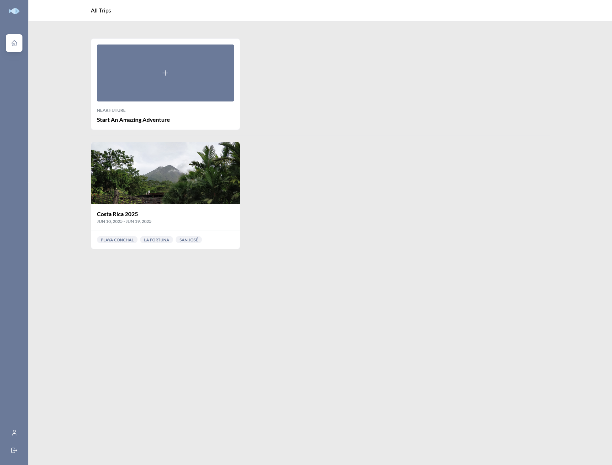
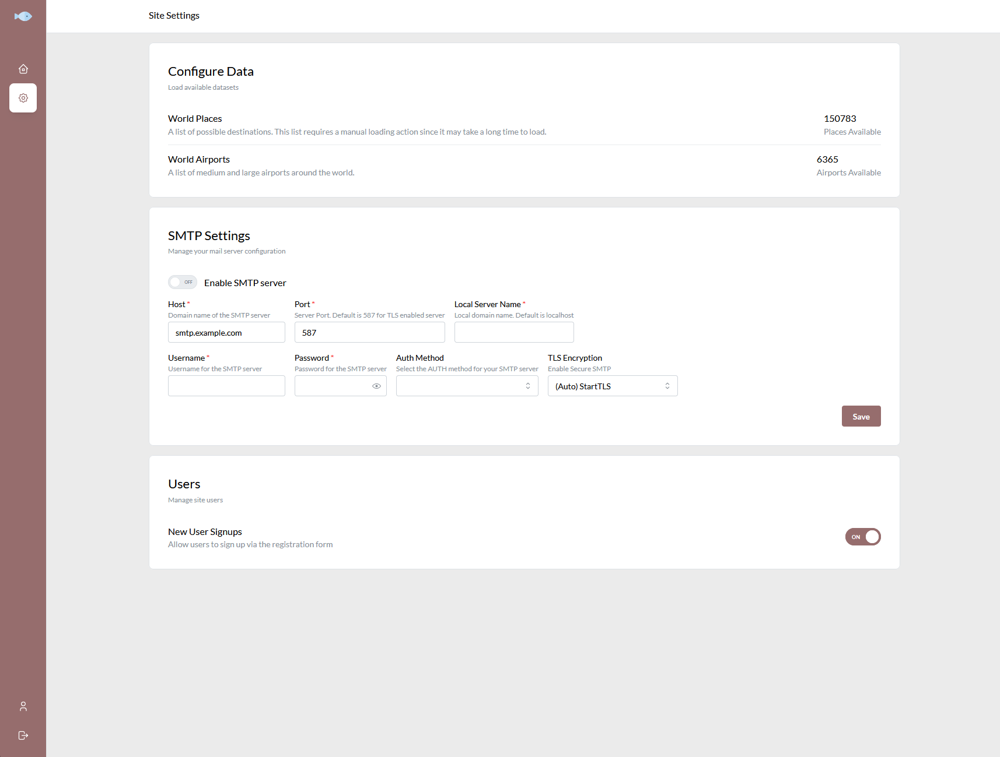
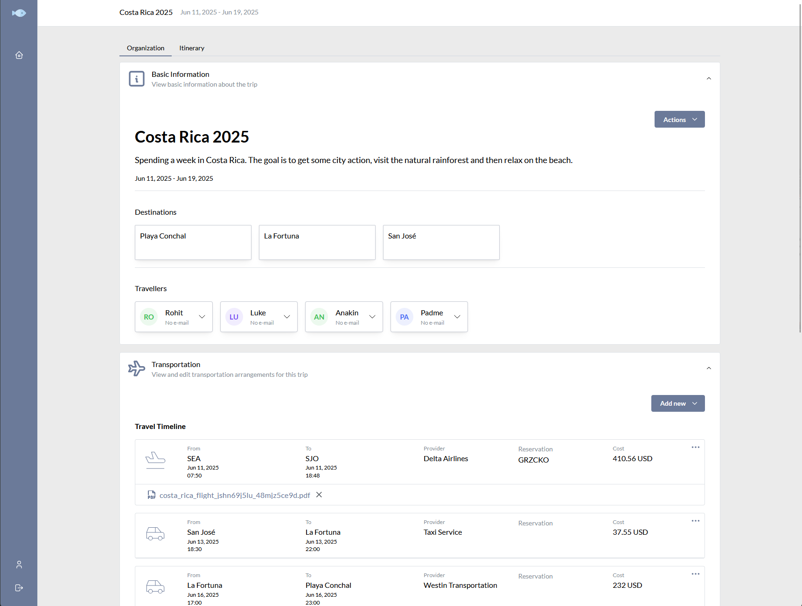
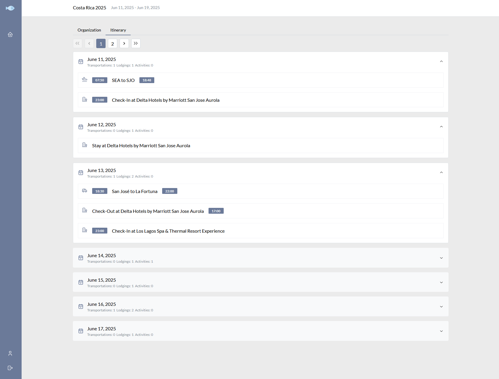
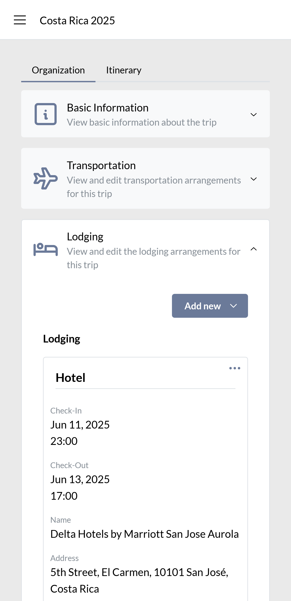
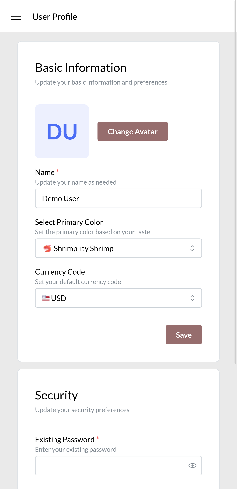
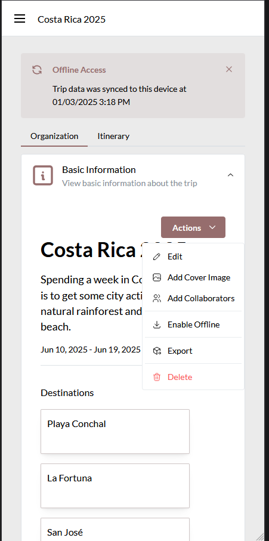

<!-- TOC -->
* [Surmai](#surmai)
* [Features](#features)
* [Rationale](#rationale)
* [Mobile Apps](#mobile-apps)
* [Screenshots / Screencasts](#screenshots--screencasts)
  * [Desktop](#desktop)
  * [Mobile](#mobile)
* [Demo](#demo)
* [Installation](#installation)
  * [By cloning the repository](#by-cloning-the-repository)
    * [Required Environment Variables](#required-environment-variables)
  * [Docker Image](#docker-image)
* [Credits](#credits)
  * [PocketBase](#pocketbase)
  * [Mantine](#mantine)
  * [Icon](#icon)
  * [Bundled Data](#bundled-data)
    * [Airports](#airports)
    * [Cities](#cities)
* [Possibly FAQ](#possibly-faq)
    * [Why so ugly tho?](#why-so-ugly-tho)
    * [Why not use ${other_thing}?](#why-not-use-other_thing)
<!-- TOC -->

# Surmai
Surmai is a personal/family travel organizer.
The app is built to solve 3 particular challenges while planning a trip:

1. Allow collaborative planning between multiple people.
2. Allow easy access to all the necessary artifacts during the course of the trip.
3. Keep the data private.

NOTE: This is a very very alpha stage project and under active development. Please report any issues using Github Issues.

# Features
- Organize a trip in one place
- Allow collaboration between multiple users
- Offline access
- Privacy
- Mobile friendly

# Rationale
As avid travellers, we (me & SO) split up the planning tasks e.g. booking plane tickets and
making dinner reservations etc, with the receipts / confirmation emails being in our own
respective inboxes. These emails were tagged but were not necessarily organized chronologically. 
It was also a huge pain to find the right email at the right time, especially
given some low bandwidth connections.

I've been a Backend software engineer for the last ~20 years. My last professional interaction with Javascript was
pre jQuery days when Internet Explorer 5 demanded we test the `navigator` every time something was to be written. I have
been exposed to the "new" Javascript at my current job as a necessity and decided to use this project as a learning
opportunity.

# Mobile Apps
Surmai is built as a [Progressive Web App](https://developer.mozilla.org/en-US/docs/Web/Progressive_web_apps/Guides/What_is_a_progressive_web_app). It's possible 
to install it as a regular app on mobile phones. [Installation Instructions](https://support.google.com/chrome/answer/9658361?hl=en&co=GENIE.Platform%3DAndroid&oco=1)

# Screenshots / Screencasts

## Desktop





## Mobile






# Demo
A demo is available at https://demo.surmai.app/

Demo Account:

Email: `demo@surmai.app`

Password: `vi#c8Euuf16idhbG`

Feel free to create an account and explore.

NOTE: The demo site is cleaned up every hour.


# Installation

The source code provides a `Dockerfile` and a `docker-compose.yaml` to get started. Ill update the documentation as I
have
a ready-to-use docker image hosted somewhere.

## By cloning the repository

### Required Environment Variables

- `SURMAI_ADMIN_EMAIL`: Email address of the initial user to be created. This email will also have admin access to the
Backend
- `SURMAI_ADMIN_PASSWORD`: Password for the initial account. Minimum of 10 characters

```bash
# Check out the source code
git clone https://github.com/rohitkumbhar/surmai.git

# Build a docker image locally
docker compose build

# Run the docker image
docker compose up -d
```
## Docker Compose
```yaml
volumes:
  surmai_data:

services:
  surmai_server:
    container_name: surmai_server
    image: ghcr.io/rohitkumbhar/surmai:v0.0.2
    volumes:
      - surmai_data:/pb_data
    ports:
      - "9090:8080"
    restart: always
    environment:
      SURMAI_ADMIN_EMAIL: admin@example.com # Add your default administrator email
      SURMAI_ADMIN_PASSWORD: ChangeMe123#@! # Admin password. Min 9 characters with all the fixings
      PB_DATA_DIRECTORY: /pb_data # Must match volume directory above

```


# Credits

## PocketBase
Surmai uses [PocketBase](https://pocketbase.io/) as it's backend platform. The API is great and the documentation is
first-class. The PocketBase Admin UI also allows for configuration that is not available from within Surmai (yet).

## Mantine
Surmai is a React based SPA built using the absolutely phenomenal library [Mantine](https://mantine.dev/). Vite for
building and prettier for formatting.

## Icon
[Fish SVG Vector](https://www.svgrepo.com/svg/280960/fish)

## Bundled Data
### Airports
From [OurAirports](https://ourairports.com/data/)

### Cities
From [countries-states-cities-database](https://github.com/dr5hn/countries-states-cities-database)


# Possibly FAQ
### Why so ugly tho?
~20 years as a backend dev, I have a tendency to lean towards function over form.

### Why not use ${other_thing}?
I wanted to learn React/Typescript, that's about it. So many side projects have languished because I gave up when it came
to building the UI. I wanted this one to be different.
